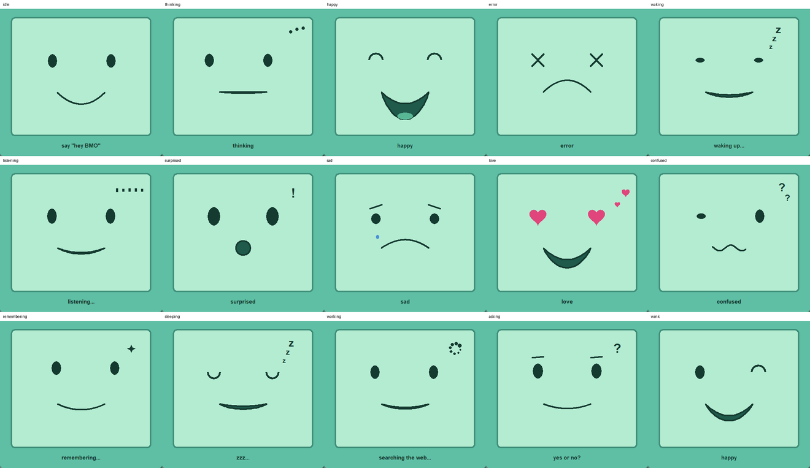

# local-bmo-agent

A little BMO-style AI friend that lives on your computer. It has an animated
face, talks out loud, listens for **"Hey BMO"**, remembers you between runs,
and can search the web, check the weather, open apps, and (with your OK) run
commands. **All of it runs locally**: the AI model, speech recognition and
text-to-speech, with no cloud accounts or API keys.



## Features

- **Local brain.** Any [Ollama](https://ollama.com) model. The default is
  `qwen2.5:3b`, which is small, fast and can use tools.
- **Face** in its own window, drawn only from the provided artwork in
  `assets/faces/all/`. It drifts between calm faces when idle, drifts off when
  left alone, and reacts to the conversation with a fitting face per state and
  per spoken sentence (happy, sad, love, surprised, confused, and more).
- **Voice out.** BMO reads replies aloud sentence by sentence, as they
  stream in, and the mouth moves with the words (Windows SAPI voices via
  `pyttsx3`).
- **Voice in.** Offline speech recognition with `faster-whisper`. Click the
  face or press SPACE and just talk; BMO stops listening when you stop.
- **Wake word.** Say "Hey BMO", or ask in one breath: "Hey BMO, what's the
  weather?"
- **Hands-free mode.** `/convo` keeps BMO listening after every answer.
- **Memory.** "Remember that my name is Sam" is saved for good, and the
  recent conversation carries over between runs.
- **Tools.** Web search (DuckDuckGo), weather (wttr.in), opening websites and
  apps, and PowerShell commands, **which always need your approval**.
- **A gentle wellbeing side.** A once-a-day mood check-in, a gratitude log, a
  private journal, a guided breathing break, and small coping ideas offered as
  options rather than instructions. It stays a friend, never a therapist, and
  hands off to real crisis lines if something serious comes up. Turn it off
  with `--no-wellness` or the `/wellness` overview.

## Requirements

| | |
|---|---|
| OS | Windows 10/11 (the main target). The core runs on macOS/Linux too, but voice output and app opening are Windows-first. |
| Python | 3.10+ (**3.12 recommended**; some voice packages may not have wheels for the newest Python yet) |
| Ollama | 0.8 or newer (tool calls while streaming), from [ollama.com](https://ollama.com) |
| RAM | ~4 GB free for `qwen2.5:3b` + speech recognition |
| Mic / speakers | Optional. Without them BMO is a text chat. |

## Installation

```powershell
# 1. get the code
git clone https://github.com/sHuCkLe1/local-bmo-agent.git
cd local-bmo-agent

# 2. download the AI model (about 2 GB)
ollama pull qwen2.5:3b

# 3. install the Python packages
py -3.12 -m pip install -r requirements.txt

# 4. run BMO
py -3.12 bmo.py
```

The first run downloads the small speech-recognition models (about 220 MB)
automatically. After that, everything works offline except web search and
weather.

> **Several Python versions installed?** Use `py -3.12 ...` as shown, so the
> packages and BMO use the same Python. See [Troubleshooting](#troubleshooting).

## Using BMO

| To... | Do this |
|---|---|
| Type to BMO | Type in the terminal and press ENTER |
| Talk to BMO | Say **"Hey BMO"**, or click the face / press SPACE in the face window / press ENTER on an empty line |
| Ask in one go | "Hey BMO, what's the weather in Tokyo?" |
| Finish talking early | Click / SPACE / ENTER again |
| Interrupt BMO | ESC in the face window, or click the face |
| Approve a command | `y`/`n` in the terminal, or say "yes"/"no" (Y/N keys in the face window also work) |

### Things to try

- "What's the weather tomorrow?" (uses your location automatically)
- "Who won the last World Cup?" (searches the web)
- "Open YouTube" / "Open the calculator"
- "How much free space is on my C drive?" (BMO shows the command and asks first)
- "Remember that my favourite colour is green", then restart BMO and ask about it
- "Thank you BMO!" (watch the face)
- \"I've had a rough day\" (BMO slows down and listens; `/mood 2` logs it)
- `/breathe` for a short guided breathing break

### Commands

| Command | What it does |
|---|---|
| `/talk` | Listen through the mic |
| `/convo` | Hands-free mode on/off (BMO keeps listening after each answer) |
| `/wake` | "Hey BMO" wake word on/off |
| `/mute`, `/unmute` | Spoken replies off/on |
| `/voices`, `/voice <name>` | List / switch text-to-speech voices |
| `/face <state>` | Preview a face (`/face` lists them all) |
| `/tools` | Show available tools |
| `/memory` | Show what BMO remembers |
| `/remember <fact>` | Save a fact |
| `/forget <n>`, `/forget all` | Forget one fact / every fact |
| `/mood <1-5> [- note]` | Log today's mood, e.g. `/mood 4 - good day` |
| `/moods` | Recent mood check-ins and a small trend |
| `/grateful <text>`, `/gratitude` | Add / read gratitude notes |
| `/journal [text]` | Write a private note, or read your last few |
| `/breathe [rounds]` | A short guided breathing break |
| `/coping <feeling>` | One small idea for a feeling, e.g. `/coping anxious` |
| `/wellness` | Where you stand, and how to reach real help |
| `/clear` | Start a fresh conversation (facts are kept) |
| `/help`, `/quit` | Help / exit |

### Command-line options

| Option | Default | Meaning |
|---|---|---|
| `--model` | `qwen2.5:3b` | Ollama model. Models without tool support (e.g. `gemma3:1b`) still work for chat; tools switch off automatically. |
| `--host` | `http://localhost:11434` | Ollama address |
| `--name` | `BMO` | BMO's name (also used for the wake word) |
| `--no-voice` / `--no-ears` | | No spoken replies / no microphone |
| `--voice`, `--rate` | Zira, 190 | Text-to-speech voice (part of its name) and speed |
| `--stt-model` | `base.en` | Whisper model for requests (`tiny.en`, `base.en`, `small.en`, ...) |
| `--mic`, `--list-mics` | | Pick a microphone / list audio devices |
| `--convo` | off | Start in hands-free mode |
| `--no-wake`, `--wake-model`, `--wake-debug` | on, `tiny.en` | Wake word off / its model / print everything it hears |
| `--no-tools`, `--no-shell` | | Chat only / everything except commands |
| `--memory-file`, `--no-memory` | `bmo_memory.json` | Where memory is saved / don't save anything |
| `--max-history` | `60` | Messages of the conversation kept in memory (bigger = better recall, more tokens; `0` = keep none) |
| `--wellness-file`, `--no-wellness` | `bmo_wellness.json` | Where moods/gratitude/journal are saved / turn the wellbeing side off |
| `--sleep-after` | `5` | Minutes of quiet before BMO dozes off (`0` = never) |
| `--system` | (BMO's personality) | Replace the personality prompt |
| `--tts-test "text"` | | Test voice output alone and exit |
| `--no-warmup` | | Don't preload the model at startup |

## Privacy and safety

- **Everything runs on your computer.** The model runs in Ollama, and speech
  recognition and text-to-speech run locally. The only internet requests are
  web searches (DuckDuckGo, Wikipedia) and weather (wttr.in), and only when
  you ask for them.
- **The wake word listener never leaves your computer.** It only runs short
  clips through Whisper when it hears speech, and pauses while BMO is
  talking. Turn it off with `/wake` or `--no-wake`.
- **Commands always need your approval.** BMO shows the exact PowerShell
  command and runs it only after a clear "yes". Anything unclear counts as
  "no". Commands time out after 30 seconds. `--no-shell` disables them
  completely.
- **App opening** accepts app names only, not file paths. **Websites** must
  be `http`/`https`.
- **Memory** is a plain JSON file (`bmo_memory.json`) next to `bmo.py`. It is
  git-ignored, so it's never committed. Delete it to reset BMO.
- **The wellbeing data** (moods, gratitude, journal) is a plain JSON file
  (`bmo_wellness.json`) next to `bmo.py`, git-ignored and never sent
  anywhere. It stays on your computer, and you can delete it any time to
  wipe it. BMO is a supportive friend, not a doctor: it doesn't diagnose or
  give medical advice, and if you sound like you're in real danger it shows
  real crisis lines (988, text HOME to 741741, findahelpline.com) instead of
  trying to handle it alone.

## Troubleshooting

| Problem | Fix |
|---|---|
| "voice input off - run: pip install ..." although you installed them | You have several Pythons and `python` isn't the one with the packages. Run `py -0p` to list them, then use `py -3.12 bmo.py` (or put that Python first in your PATH). |
| "can't reach Ollama" | Open the Ollama app, or run `ollama serve`. |
| "model not found" | `ollama pull qwen2.5:3b` |
| "... can't use tools" | The model doesn't support tool calling. Use `--model qwen2.5:3b`. |
| No sound | `py -3.12 bmo.py --tts-test "hello"` tests voice output by itself. `/voices` lists voices. |
| BMO doesn't hear you | `py -3.12 bmo.py --list-mics`, then `--mic <number>` |
| Wake word misses you / wakes by itself | Run with `--wake-debug` to see what it hears. Speak a little slower: "Hey... BMO". |
| First reply is slow | Normal. The model loads into memory (10-40 s); after that replies take a few seconds. |

## How it works

`bmo.py` is one file, split into small classes: `Face`, `Speaker`,
`Listener`, `WakeWord`, `Memory`, `Wellness`, `Tools` and `Agent`, each
running on its own thread. See **[docs/ARCHITECTURE.md](docs/ARCHITECTURE.md)** for the
full explanation. It covers the threads, what happens during one
conversation turn, the tool loop, how the wake word avoids false alarms, and
lessons learned about prompting small models.

## Limitations

- A 3B model is small: it occasionally misreads search results or slips out
  of character. For better answers, try a larger tool-capable model such as
  `--model qwen3:4b` or `--model llama3.1:8b` (slower, needs more RAM).
- Mood reactions come from keywords, so the face sometimes reacts to the
  wrong thing.
- The wellbeing side is a friend, not a clinician: it can't assess risk,
  and its coping tips are generic. It never replaces real support - see
  `/wellness` for crisis lines.
- Voice output uses Windows SAPI voices. On other systems `pyttsx3` falls
  back to espeak/NSSpeechSynthesizer, which is less tested.

## License

[MIT](LICENSE). BMO is a character from *Adventure Time*; this is an
unofficial fan project and is not affiliated with Cartoon Network.
