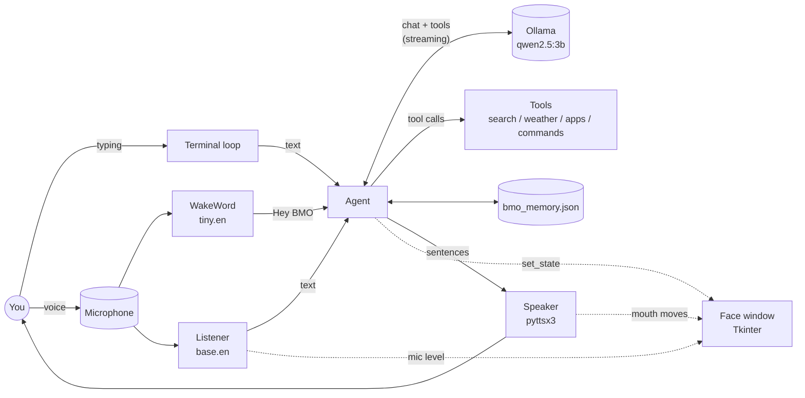
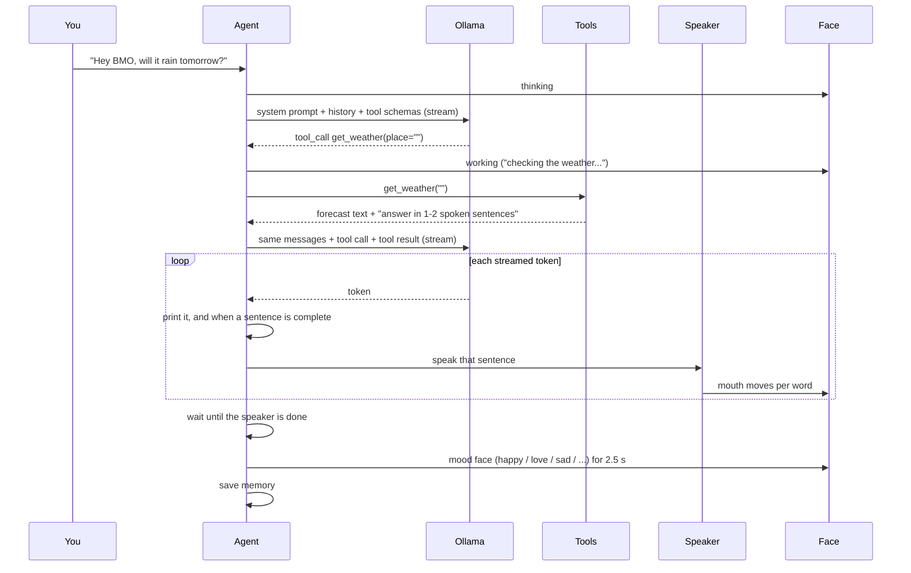
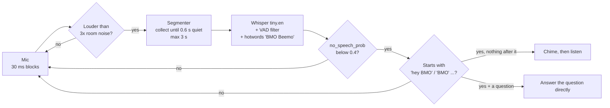

# How BMO works

This document explains the inside of `bmo.py`: what each part does, how the
parts talk to each other, and why some less obvious decisions were made. It
is meant for anyone who wants to understand or change the code.

- [The big picture](#the-big-picture)
- [Threads](#threads)
- [The components](#the-components)
- [One conversation turn](#one-conversation-turn)
- [The tool loop](#the-tool-loop)
- [The wake word](#the-wake-word)
- [Memory](#memory)
- [The face](#the-face)
- [Lessons learned](#lessons-learned)
- [Extending BMO](#extending-bmo)

## The big picture

BMO is a single Python file, built around one idea: **every slow thing gets
its own thread, and the face just shows whatever state it's told**.



| Part | Library | Runs where |
|---|---|---|
| Brain | Ollama `/api/chat` over HTTP (plain `urllib`, no SDK) | Local Ollama server |
| Face | Tkinter canvas, redrawn about 60 times a second | Main thread |
| Voice out | `pyttsx3` (Windows SAPI voices) | Speaker thread |
| Voice in | `faster-whisper` + `sounddevice` | Listener thread / the current turn's thread |
| Wake word | `faster-whisper` (`tiny.en`) + a loudness gate | WakeWord thread |
| Search / weather | DuckDuckGo HTML, Wikipedia API, wttr.in | The current turn's thread |

## Threads

Tkinter insists on running on the main thread, so everything else runs
beside it:

| Thread | Lifetime | Job |
|---|---|---|
| main | whole run | Tk `mainloop()`: animates and draws the face |
| CLI | whole run | Reads what you type. Typed messages are answered on this thread. |
| Speaker worker | whole run | Speaks queued sentences one at a time |
| Listener loader | startup | Loads the whisper model |
| WakeWord | whole run | Listens for "Hey BMO" while nothing else is happening |
| warm-up | startup | Loads the Ollama model so the first reply is fast, checks tool support |
| voice turn | per spoken request | Listens, transcribes, and answers one voice request (or several in `/convo`) |

**How threads talk to the face.** Other threads never call Tk directly.
They only set plain attributes (`face.set_state("thinking")`,
`face.talk(n)`, `face.mic_level = 0.4`), and the face's `tick()` reads them
on the main thread every 16 ms. Writing a Python attribute is atomic, so no
locks are needed.

**One turn at a time.** `Agent.turn_lock` makes sure only one conversation
turn runs at a time, whether it came from typing, a click or the wake word.
`Agent.cancel` (an `Event`) lets ESC or a click interrupt a reply midway:
the stream stops being read and the speaker's queue is emptied.

## The components

### `Face`
Draws BMO on a `tk.Canvas` from a handful of numbers: eye openness, eye
size, where the eyes look (x/y), mouth openness, mouth width and smile
(-1 frown ... +1 smile). Each state (`idle`, `thinking`, `love`, ...) only
sets **targets** for these numbers. Every frame, each number moves a fraction
of the way toward its target, so switching expressions always animates
smoothly instead of jumping.

Extra details are drawn on top per state: heart eyes, the tear, Z's,
question marks, the sparkle, the spinner. `set_state(state, hold=2.5)` goes
back to `idle` after 2.5 s. `idle_life()` adds random glances, winks and
yawns, and switches to `sleeping` after `--sleep-after` minutes without
activity.

### `Speaker`
A queue of sentences and a worker thread. On Windows, a pyttsx3/SAPI engine
reliably speaks only **once**: the second `runAndWait()` on the same engine
often reports success but stays silent. So a new, cheap engine is created for
every sentence. The engine's `started-word` callback calls `face.talk()`,
which makes the mouth move with the actual words. `idle` (an `Event`) is set
when nothing is queued, and other parts use it to wait for BMO to finish
talking.

### `Listener`
`record()` opens the mic, measures the room's noise for 0.3 s, then records
until you've been quiet for 1.1 s (or you press the key again). `transcribe()`
runs faster-whisper with its voice-activity filter and a `hotwords` hint
(BMO's name) so "BMO" is spelled right. It also drops whisper's well-known
hallucinations on silence ("you", "thanks for watching").

### `Segmenter` and `WakeWord`
See [The wake word](#the-wake-word).

### `Memory`
Facts and the last 20 messages, saved as JSON. See [Memory](#memory).

### `Tools`
Each tool is a normal method plus a JSON schema that tells the model what
arguments it takes. `Tools.run()` never raises an exception: errors are
returned to the model as text ("Error: couldn't find an app called ..."), so
the model can explain the problem or try something else.

| Tool | How it works | Guard rails |
|---|---|---|
| `web_search` | Scrapes `html.duckduckgo.com` (no API key); falls back to the Wikipedia search API | Output is size-capped |
| `get_weather` | `wttr.in/<place>?format=j1`; an empty place means "where the user is" (IP-based) | none needed |
| `open_website` | `webbrowser.open` | `http`/`https` only |
| `open_app` | `os.startfile` with a table of friendly names (`calculator` becomes `calc`, `settings` becomes `ms-settings:`, ...) | Names only; anything with `/`, `\` or `..` is refused |
| `run_command` | `powershell -NoProfile -NonInteractive -Command ...` | **Always asks the user first**, 30 s timeout, output capped at 1500 characters |

### `Agent`
Ties everything together: builds the prompt, streams the reply, runs tools,
speaks, picks the mood face and saves memory. Covered in detail below.

## One conversation turn



The **system prompt** is rebuilt for every turn from:

1. `Your name is BMO. It is now <date and time>.`, so the model knows the date
   without needing a tool.
2. The personality (`--system`).
3. Tool instructions, including the real home and desktop folder paths (so
   the model doesn't invent `C:\Users\YourUsername`).
4. A "stay in character" reminder **with an example answer**.
5. The saved facts about the user.

**Speaking while streaming.** Tokens are collected until a sentence ends
(`.`, `!`, `?` or a newline), and each complete sentence goes to the speaker
right away. BMO starts talking long before the model has finished writing.
Markdown symbols and emoji are removed before speaking.

**Mood.** After the reply, `pick_mood()` checks the user's words, then
BMO's reply, against keyword patterns (`MOODS`), for example "thank you"
gives `love` and "my dog died" gives `sad`. The default is `happy`. If a
fact was just saved, the face shows `remembering` instead.

## The tool loop

```python
for round in range(MAX_TOOL_ROUNDS + 1):      # up to 4 tool rounds
    text, calls = stream(messages, allow_tools=(round < MAX_TOOL_ROUNDS))
    if no text and no calls:       retry once without tools
    if said "let me check" but made no call:  nudge once and loop
    if no calls:                   done
    run each call, append the results as {"role": "tool"} messages
```

Details worth knowing:

- **The last round offers no tools**, so the model must answer instead of
  calling tools forever.
- **Tool calls and results stay inside the turn.** `history` only stores
  what was said ("user: will it rain?", "assistant: Probably not..."). That
  keeps the saved memory small and readable, and old search results don't
  fill up the context.
- **Models without tool support** (like `gemma3:1b`) are detected at startup
  through `/api/show` capabilities, and again if Ollama answers a request
  with HTTP 400 "does not support tools". Tools then switch off and BMO
  keeps chatting.
- **Confirmation** (`Agent.confirm`) depends on how the turn started. Typed
  turns ask `y/n` in the terminal (safe, because the turn runs on the CLI
  thread, so `input()` is free). Voice turns ask out loud, then listen for
  yes/no. Y/N keys in the face window also work. Anything that isn't a clear
  yes counts as no.

## The wake word

A wake word has to be listening all the time, so it has to be cheap, and it
must not go off by accident. The pipeline:



- **Cheap.** Whisper only runs on short bursts of real sound, at most the
  first 3 s of anything said (longer speech is skipped until the next
  pause). On a laptop CPU that's about 0.35 s per check.
- **Pauses itself** whenever BMO is busy, listening, asking a question or
  talking, and for 2 s after triggering. It closes the mic while paused, so
  it never hears BMO's own voice.
- **Name spellings.** Whisper writes "Beemo" in many ways. With the hotword
  hint it's almost always "BMO" or "Beemo". Without it you get "Bima",
  "FEMA", "Beamer", "be emo" and more. Strong spellings (`bmo`, `beemo`,
  `b m o`) count near the start of any sentence. Weak ones (`bima`, `fema`,
  `beamer`, ...) count only right after "hey/hi/ok", so "FEMA sent help"
  doesn't wake BMO.
- **Noise protection.** The `hotwords` hint has a side effect: on pure noise
  (a hum, a door thump, static) whisper "hears" the hotword. Testing showed
  that every noise clip was transcribed as "BMO". Two independent filters fix
  this: faster-whisper's VAD removes non-speech first, and any segment whisper
  rates as `no_speech_prob >= 0.4` is ignored. In testing, noise scored 0.5
  or higher and real speech about 0.01.

**Tested with:** 16 wake phrases in two voices (all detected, including
question-in-the-same-breath), 10 look-alike sentences such as "Hey Bob",
"demo" and "memo" (none triggered), long speech, and noise bursts and clicks
(none triggered). The clips were fed through the real segmenter and model in
30 ms blocks, exactly like the live mic.

## Memory

`bmo_memory.json`:

```json
{
  "facts": ["my name is Sam", "I have a cat called Pickles"],
  "history": [
    {"role": "user", "content": "..."},
    {"role": "assistant", "content": "..."}
  ]
}
```

- **Facts** come from `/remember ...` or from saying "remember that ..."
  (a regex, not the model, so it's instant and reliable). Questions such as
  "remember when...?" or "do you remember my name?" are not stored.
- Facts are kept in your own words but **given to the model in third
  person** ("my name is Sam" becomes "The user's name is Sam"). With
  first-person facts, small models mixed up who "my" referred to and
  introduced *themselves* as Sam.
- **Saving is crash-safe**: the file is written to `.tmp` and then swapped
  in with `os.replace`. An unreadable file is renamed to `.broken` instead of
  being overwritten.
- The file is git-ignored.

## The face

All 15 states are listed in `STATES`, and `/face <state>` previews any of
them. Adding one takes three steps:

1. Add its name to `STATES`.
2. In `Face.tick()`, set its targets (`eye`, `look`, `look_y`, `mouth`,
   `smile`, `scale`, `mouth_w`).
3. Optionally draw extras in `Face.draw()` (see `love`, `sad` or `working`),
   and give it a caption.

## Lessons learned

Things that didn't work the obvious way and are handled on purpose in the
code:

1. **Small models follow examples and nearby hints, not rules.**
   - "Never say you are an AI" was ignored. One sample answer ("Ooh, teal!
     It's the color of my case...") fixed most of it.
   - Hints appended **to the tool result itself** ("answer in 1-2 spoken
     sentences, no lists or links") work much better than the same rule in
     the system prompt. Before this, BMO read out whole forecasts and lists
     of markdown links.
   - "Always search for recent events" wasn't enough for "who won the 2026
     World Cup?" (0/4). Concrete examples ("who won a game, match or
     election... anything dated 2024 or later") made it 3/4.
   - When the user declines a command, the tool result gives the exact reply
     to use ("Okay, I won't run it."). Otherwise the model kept asking for
     permission again.
   - Changes were measured by running each test prompt 4 times and counting
     correct tool calls (28/32 before, 30/32 after), not judged on one run.
2. **The model sometimes says it will act instead of acting** ("Let me check
   the web for you." with no tool call). The agent detects that phrase (and
   commands written in backticks) and nudges once: "go ahead and use your
   tools."
3. **pyttsx3 on Windows only speaks once per engine**, so a new engine is
   made per sentence.
4. **Whisper hotwords cause hallucinations on noise**, hence the double
   filter in the wake word.
5. **A startup deadlock on Windows.** Importing numpy (loading its DLLs) on
   a background thread while Tk starts up could freeze startup inside the
   Windows DLL loader: the speech libraries hung at "loading speech
   recognition", sometimes along with the Ollama connection. Importing
   `numpy`, `sounddevice` and `faster_whisper` on the main thread before
   creating the Tk window fixed it.
6. **Two Pythons on one machine.** Packages installed for 3.12 aren't
   visible to 3.14. `py -3.12 bmo.py` avoids that.

## Extending BMO

**Add a tool** (in `Tools.__init__`):

```python
self.funcs["tell_time_in"] = self.tell_time_in
self.schemas.append(_tool(
    "tell_time_in", "Current time in another city.",
    city=("string", "the city")))
```

Then write `def tell_time_in(self, city=""):` that returns a string. Tools
take one argument; `Tools.run` maps whatever key the model sends onto it.
Mention the tool in `Tools.PROMPT` if the model needs a hint about when to
use it. For anything risky, use `confirm` the way `run_command` does.

**Change the personality:** `--system "..."` or the default in `main()`.

**Use a different model:** any Ollama model works for chat, but tools need
one with tool support (look for the "tools" tag on ollama.com). Larger
models (`qwen3:4b`, `llama3.1:8b`) follow instructions better, at the cost
of speed and memory.
